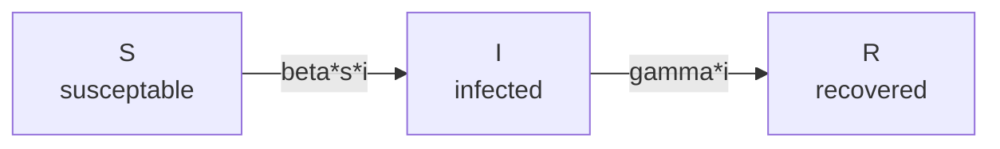

# SIR Models

The original SIR model was proposed in ”[Contribution to the Mathematical Theory of Epidemics” William Kermack and Anderson McKendrick](https://doi.org/10.1098/rspa.1927.0118), 1927. The population (N) is divided into 3 pools: S, I, and R.

$$\begin{align*}
S \rightarrow I \rightarrow R && S(t)&=\text{number that are susceptible at time }t&&s(t)=S(t)/N\\
 && I(t)&=\text{number that are infected}&&i(t)=I(t)/N\\
  && R(t)&=\text{number that are recovered or dead}&&r(t)=R(t)/N\\
  \end{align*}$$

At each timestep, individuals move between the 3 pools. Most papers tend to list the change in $s$, $i$ and $r$ functions, shown below on the left. To actually calculate the next $s$, $i$, $r$ numbers for the next time step $(t + 1)$ use the functions on the right.

$$\begin{align*}
\frac{ds}{dt}&=-\beta si && s(t+1)=s(t)-\beta s(t) i(t) \\
\frac{di}{dt}&=\beta si - \gamma i && i(t+1)=i(t)+ \beta s(t) i(t) - \gamma i(t)\\ 
\frac{dr}{dt}&=\gamma i&&r(t+1)= r(t)+\gamma i(t)\\
\end{align*}$$

where: 

$$\begin{align*}
\beta = \text{rate of infection} &&
\gamma = \text{rate of recovery}
\end{align*}$$

## Estimating the rate of infection ($\beta$) and the $m$ ($m=\beta-\gamma$)

Since initially the susceptable population is almost equal to the total population ($S \approx N$), 

$$\begin{align*}
\frac{dI}{dt} &= \frac{\beta}{N} S I-\gamma I  && \text{definition} \\
\frac{dI}{dt} &= \beta I - \gamma I  && \text{where } S \approx N \text{ at } t \approx 0 \\
\frac{dI}{dt} &= I (\beta - \gamma)  && \text{factor out } I \\
I &= I_{0} e^{(\beta - \gamma)t} && \text{integrate}
\end{align*}$$

<!-- Attempts that did not work exactly right
$$S \rightarrow I \rightarrow R && S(t)&=\text{number that are susceptible at time }t&&s(t)=S(t)/N\\
 && I(t)&=\text{number that are infected}&&i(t)=I(t)/N\\
  && R(t)&=\text{number that are recovered or dead}&&r(t)=R(t)/N\\$$
  
$$
S \rightarrow I \rightarrow R && S(t)&=\text{number that are susceptible at time }t&&s(t)=S(t)/N\\
 && I(t)&=\text{number that are infected}&&i(t)=I(t)/N\\
  && R(t)&=\text{number that are recovered or dead}&&r(t)=R(t)/N\\
  $$
  
$$\begin{eqnarray} 
S \rightarrow I \rightarrow R && S(t)&=\text{number that are susceptible at time }t&&s(t)=S(t)/N\\
 && I(t)&=\text{number that are infected}&&i(t)=I(t)/N\\
  && R(t)&=\text{number that are recovered or dead}&&r(t)=R(t)/N\\
  \end{eqnarray}$$-->
  

